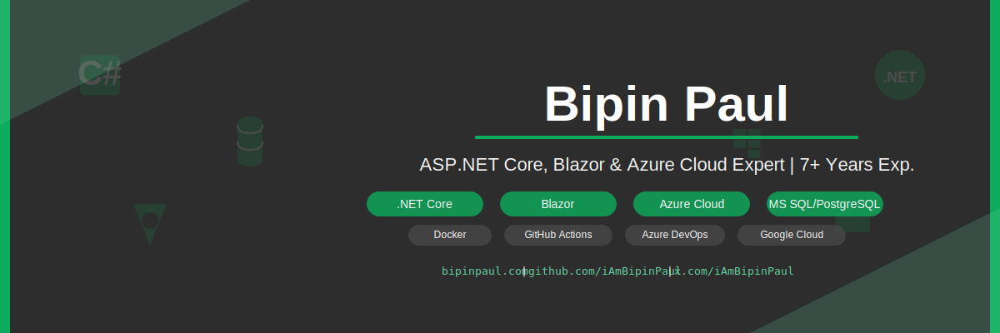

### Hey, I'm Bipin Paul 👋

I've spent the last **7+ years** building web applications for everything from social media platforms to healthcare systems. My favorite stack is **.NET Core** and **Blazor**, and while I specialize in solving complex backend problems, I'm just as comfortable working across the full stack.

---

### 🛠️ What I Work With
*   **The Core**: ASP.NET Core & Blazor are my go-to tools for building fast, reliable web apps.
*   **Data**: I rely on **MS SQL** and **PostgreSQL** to keep data organized and scalable.

### ☁️ Cloud & Ops
*   **Azure**: I use Functions, Cosmos DB, and Service Bus to build cloud-native solutions.
*   **Google Cloud**: Experienced with deploying to Cloud Functions and Cloud Run.
*   **Toolbelt**: `Docker` • `GitHub Actions` • `Azure DevOps`

---

I believe software development is a craft that never stops evolving. I'm always learning new patterns, trying new tools, and looking for the next interesting challenge.

Let's build something great together.

